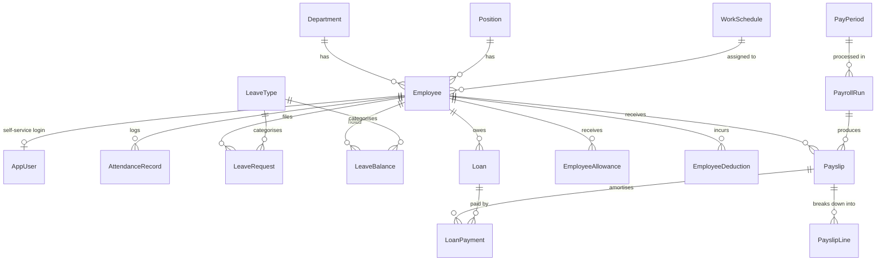

# Payroll Management System — Implementation Plan

**Project:** PAYROLLSystem
**Locale:** Philippines (DOLE / BIR / SSS / PhilHealth / Pag-IBIG)
**Written:** 2026-08-13
**Status:** In progress — **phases 0–7 built and verified; phase 8 part-built (payroll
register and the three remittance reports done); year-end tax annualisation closed, so the
engine now computes a full year correctly; 9 remaining** (see §9)

> This document is kept current as the build proceeds. Where the implementation
> diverged from the original plan, the plan has been corrected to describe what was
> actually built, with the reason noted.

---

## 1. Goals & Scope

A web-based payroll system for a single Philippine company that handles the full cycle
from employee masterfile → daily time records → payroll computation → payslip → statutory
remittance reports.

### In scope (all four modules confirmed)

| Module | Contents |
|---|---|
| **Core payroll** | Employees, departments, positions, pay periods, payroll runs, payslip generation & viewing |
| **Auth & roles** | Login, JWT/cookie auth, roles: Admin, HR Manager, Payroll Officer, Employee (self-service) |
| **Attendance & leave** | Daily time records, overtime, undertime/late, night differential, holiday premiums, leave types, balances, requests & approvals |
| **Loans & reports** | SSS/Pag-IBIG/company loans with amortization, payroll register, remittance reports, BIR 2316/1601-C data, CSV & PDF export |

### Explicitly out of scope (v1)

- Multi-company / multi-branch tenancy (schema leaves room; UI does not expose it)
- Biometric device integration (CSV/Excel DTR import instead)
- Direct bank file transmission (we generate the bank disbursement file; sending is manual)
- Actual e-filing to BIR EFPS/eBIRForms (we produce the data + printable forms)

---

## 2. Tech Stack

Verified present on this machine:

| Layer | Choice | Version |
|---|---|---|
| Runtime | .NET SDK | 10.0.302 |
| Backend | ASP.NET Core Web API | net10.0 |
| ORM | EF Core (SQL Server provider) | 10.0.11 |
| EF tooling | `dotnet ef` | 10.0.11 |
| Database | SQL Server LocalDB | `(localdb)\MSSQLLocalDB` |
| Frontend | React + Vite | React 19.2, Vite 8.2 |
| Node | Node / npm | 24.12.0 / 11.6.2 |
| Tests | xUnit | 2.9.3 |

### Server packages — installed

| Package | Version | For |
|---|---|---|
| `Microsoft.EntityFrameworkCore.SqlServer` / `.Design` / `.Tools` | 10.0.11 | ORM and migrations |
| `Microsoft.AspNetCore.Identity.EntityFrameworkCore` | 10.0.11 | Users, roles, password hashing |
| `Microsoft.AspNetCore.Authentication.JwtBearer` | 10.0.11 | Access-token validation |
| `Microsoft.Extensions.Diagnostics.HealthChecks.EntityFrameworkCore` | 10.0.11 | Database readiness probe (not in the original plan) |
| `Microsoft.AspNetCore.OpenApi` | 10.0.11 | API description |
| `FluentValidation.AspNetCore` | 11.3.1 | Request validation |
| `ClosedXML` | 0.105.1 | `.xlsx` DTR import; Excel report export in Phase 8 |
| `Serilog.AspNetCore` | 10.0.0 | Structured logging |
| `QuestPDF` | 2026.7.3 | Payslip PDF (Phase 6); report PDFs in Phase 8 |

> **Security note:** the template shipped `Microsoft.AspNetCore.OpenApi` 10.0.10, which
> pulled `Microsoft.OpenApi` 2.0.0 — subject to a known high-severity advisory
> ([GHSA-v5pm-xwqc-g5wc](https://github.com/advisories/GHSA-v5pm-xwqc-g5wc)). Bumping to
> 10.0.11 pulls 2.7.5 and clears it. Do not downgrade.

> **QuestPDF licence.** Free under its Community licence below the revenue threshold in its
> terms. `Program.cs` declares `LicenseType.Community`, which is a statement that this
> deployment qualifies — **check it against the current licence before go-live**, the same
> way the statutory tables are checked.

**Deliberately not used:** `FluentAssertions`. Version 8 onward requires a **paid
commercial licence** for non-open-source use, which this project would need. The test
project uses xUnit's own assertions and has no extra dependencies.

### Client packages — installed

| Package | Version | Status |
|---|---|---|
| `react-router` | 8.3 | In use — routing |
| `@tanstack/react-query` | 5.101 | In use — all server state |
| `tailwindcss` + `@tailwindcss/vite` | 4.3 | In use — styling |
| `lucide-react` | 1.31 | In use — icons |
| `@fontsource/ibm-plex-sans` / `-mono` | 5.3 | In use — self-hosted fonts, no CDN (not in the original plan) |
| `react-hook-form`, `zod`, `@hookform/resolvers` | 7.85 / 4.4 / 5.7 | **Installed, not used** |
| `date-fns` | 4.4 | **Installed, not used** |

`recharts` was listed in the original plan but never installed; it is only needed for the
Phase 9 dashboard.

> **Divergence worth a decision.** Forms were built with plain `useState` and validated
> server-side by FluentValidation, with errors mapped back onto fields from
> `ValidationProblemDetails`. That works and is proven end to end, so `react-hook-form`
> and `zod` were never wired in. Either adopt them in a later phase or drop the four
> unused packages — leaving them installed but idle is the worst of both.

---

## 3. Solution Structure

Keep the existing two-project solution (`PAYROLLSystem.slnx`). The server becomes a
**modular monolith** organised by folder — no extra class libraries, which keeps the
build simple and the VS F5 experience intact.

Every folder below now exists; the phase that created the later ones is noted against them.

```
PAYROLLSystem/
├─ PAYROLLSystem.Server/
│  ├─ Domain/
│  │  ├─ Entities/           # Employee, Payslip, AttendanceRecord, …
│  │  │  └─ Statutory/       # SSS/PhilHealth/Pag-IBIG/tax tables, premium rates
│  │  ├─ Enums/              # PayFrequency, HolidayType, PayrollRunStatus, …
│  │  └─ Identity/           # AppUser, AppRole, RefreshToken, AppRoles
│  ├─ Data/
│  │  ├─ PayrollDbContext.cs
│  │  ├─ Configurations/     # IEntityTypeConfiguration<T>, grouped per aggregate
│  │  ├─ Seed/               # statutory, reference, identity, demo seeders
│  │  └─ Migrations/         # InitialCreate, AddIdentity
│  ├─ Features/              # vertical slices
│  │  ├─ Admin/              # user list (Admin only)
│  │  ├─ Attendance/
│  │  │  └─ Import/          # DTR file reader, parser, import service
│  │  ├─ Auth/
│  │  ├─ Employees/
│  │  ├─ Health/
│  │  ├─ Leave/
│  │  ├─ Organization/       # departments, positions, work schedules
│  │  ├─ Loans/              # setup, ledger, amortisation schedule (Phase 7)
│  │  ├─ Payroll/            # controllers, run service, PDF (Phase 6)
│  │  │  ├─ Engine/          # ← the calculation core (Phase 5)
│  │  │  └─ Statutory/       # SSS, PhilHealth, Pag-IBIG, BIR calculators
│  │  └─ Reports/            # register, remittances, the shared grid (Phase 8)
│  │     └─ Export/          # CSV, Excel and PDF writers, one per format
│  ├─ Common/                # paging, validation filter, ICurrentUser
│  ├─ Program.cs
│  └─ appsettings.json
├─ PAYROLLSystem.Tests/       # xUnit — created in Phase 4, not 5 (see §9.2)
└─ payrollsystem.client/
   └─ src/
      ├─ api/                # fetch client with refresh retry, per-feature modules
      ├─ auth/               # AuthProvider + context
      ├─ components/         # ui.jsx (incl. PageHeader/EmptyState/Skeleton/ConfirmButton), DataTable, Guilloche, DtrImportPanel
      ├─ layouts/            # AppShell
      ├─ pages/              # one file per screen; employees/, payroll/, loans/, reports/ and me/ have folders
      ├─ routes/             # ProtectedRoute
      └─ App.jsx
```

Each `Features/X` folder holds its controller, DTOs, validators and service —
so one concern lives in one place.

**Two divergences from the original sketch.** The client uses `pages/` rather than
`features/` — the screens are thin enough that mirroring the server's slicing would
have added folders without adding clarity — and there is no `lib/`, because the few
shared formatters live with the components that use them (`Peso` in `ui.jsx`, time
helpers in `api/attendance.js`).

---

## 4. Domain Model

### 4.1 Entity relationship overview



### 4.2 Key entities

**Employee** — the masterfile.
`EmployeeNo`, name parts, birth date, sex, civil status, contact, address,
`HireDate`, `RegularizationDate`, `SeparationDate`, `EmploymentStatus`
(Probationary / Regular / Contractual / ProjectBased / PartTime / Seasonal / Consultant),
`DepartmentId`, `PositionId`, `WorkScheduleId`,
`PayType` (Monthly / Daily / Hourly), `BaseRate`, `PayFrequency`,
government IDs (`Tin`, `SssNumber`, `PhilHealthNumber`, `PagIbigNumber`),
`IsMinimumWageEarner`, per-contribution exemption flags, bank details.

> `IsMinimumWageEarner` matters: MWEs are exempt from income tax on basic pay,
> holiday pay, OT, night differential and hazard pay.

> **No `TaxStatus` field.** The original plan listed one. The TRAIN law (RA 10963)
> removed personal and additional exemptions, so withholding no longer depends on civil
> status or number of dependants — a `TaxStatus` column would imply an effect it does
> not have.

> **No `AppUserId` on Employee.** The link to a self-service login lives only on
> `AppUser.EmployeeId`. Carrying it on both sides gives two columns that can disagree.

Government identifiers are stored **digits only**. `123-456-789` and `123456789` are the
same TIN, and storing them as typed would let the same person be entered twice past the
uniqueness check.

**AttendanceRecord** — one row per employee per day.
`Date`, `TimeIn`, `TimeOut`, break punches, `CrossesMidnight`, computed `RegularHours`,
`LateMinutes`, `UndertimeMinutes`, `NightDifferentialHours`,
`OvertimeHoursRendered` **and** `OvertimeHoursApproved` (only the latter is paid),
`Status` (Present / Absent / OnLeave / Holiday / RestDay / HalfDay / Suspended),
`Source` (Manual / Import / Biometric / Generated), `IsLocked`.

> **Day classification is two fields, not one.** The original plan had a single `DayType`
> enum. The DOLE premium matrix is genuinely two-dimensional — a regular holiday *falling
> on a rest day* pays 2.6× — so the record carries `HolidayType?` (null on an ordinary
> day) alongside an `IsRestDay` flag. One enum would have needed every combination
> enumerated as its own member.

**PayPeriod** — `Code` (e.g. `2026-08-B`), `StartDate`, `EndDate`, `PayDate`,
`Frequency` (SemiMonthly default, also Monthly / Weekly), `Status` (Open / Processing / Closed).

**PayrollRun** — `PayPeriodId`, `RunType` (Regular / ThirteenthMonth / FinalPay / Adjustment),
`Status` (Draft → Calculated → Approved → Posted → Paid, plus Cancelled),
`ProcessedBy`, `ApprovedBy`, timestamps. A run is **recomputable while Draft/Calculated**
and **immutable once Approved**.

**Payslip** — header totals *plus a snapshot* of the rates used
(`BaseRateSnapshot`, `DailyRate`, `HourlyRate`, `MonthlySalaryCredit`) so a reprint years
later reproduces the original figures even after the employee's rate changes.

**PayslipLine** — the itemised breakdown. This is the single most important table for
auditability:

| Field | Purpose |
|---|---|
| `Category` | Earning / Deduction / EmployerContribution / Informational |
| `Code` | `BASIC`, `OT_REG`, `ND`, `HOL_REG`, `SSS_EE`, `PHIC_EE`, `HDMF_EE`, `WTAX`, `LATE`, `LOAN_SSS`, … |
| `Description`, `Quantity`, `Rate`, `Amount` | human-readable computation |
| `IsTaxable` | drives the withholding-tax base |
| `SortOrder` | payslip layout |

Employer-side contributions are stored as `EmployerContribution` lines — they never touch
net pay but are required for remittance reports.

**Statutory tables** — all four are *effective-dated* rows in the database, never
constants in code:
`SssContributionBracket`, `PhilHealthRate`, `PagIbigRate`, `WithholdingTaxBracket`.
Each carries `EffectiveFrom` / `EffectiveTo`, so a rate change is a data edit plus a new
row — historical runs stay correct.

---

## 5. Payroll Calculation Engine

The heart of the system, **built in Phase 5**. Lives in `Features/Payroll/Engine` and
`Features/Payroll/Statutory`, is **pure** — no DB calls inside the calculators, data is
loaded up front into a `PayrollContext` — and carries the bulk of the test suite.

### 5.1 Pipeline

`PayrollCalculator.Calculate(employee, context)` is a pure function from one
`EmployeePayrollInput` to one `PayslipDraft`. The run service (Phase 6) loads the context,
maps each employee in, and persists the drafts.

```
PayrollRunService.Calculate(payPeriodId)          ← Phase 6
  │
  ├─ 1. Load PayrollContext   settings, premium matrix, SSS/PhilHealth/Pag-IBIG/tax
  │                            tables effective on PayDate
  │
  ├─ 2. PayrollCalculator.Calculate, per employee ──────────────────┐
  │     a. RateResolver          monthly → daily → hourly           │
  │     b. EarningsCalculator    basic, premiums, OT, ND, holiday   │
  │     c. AbsenceCalculator     late, undertime, absent, unpaid    │
  │     d. AllowanceCalculator   de-minimis split, ₱90k pool        │
  │     e. Sss/PhilHealth/PagIbigCalculator   (EE + ER)             │
  │     f. WithholdingTaxCalculator   taxable base → BIR table      │
  │     g. LoanCalculator        amortisation due this period       │
  │     h. other deductions      never affect the tax base          │
  │     i. Assemble → PayslipDraft + PayslipLineDraft[]             │
  │◄────────────────────────────────────────────────────────────────┘
  │
  └─ 3. Persist run totals, set Status = Calculated
```

A `RunType = ThirteenthMonth` context takes a separate branch: it pays the PD 851
entitlement, charges it against the ₱90,000 exclusion, and takes no contributions and no
loan amortisations.

### 5.1a Salary coverage — the one idea to hold on to

Not in the original plan, and the decision most likely to be questioned, so it is written
down. A premium line pays only **what the employee's pay arrangement does not already
cover**:

- With the 313 factor — 365 days less 52 Sundays — a **monthly** salary already pays for
  every calendar day *except a rest day*, regular holidays included. So working an ordinary
  day produces no line at all; working a regular holiday adds the remaining 1.00× rather
  than the full 2.00×; a plain rest day is covered by nothing and pays the full 1.30×.
- A **daily- or hourly-paid** employee is covered by nothing. Every worked day pays its
  full multiplier, and an unworked regular holiday gets its own `HOL_REG_UNWORKED` line
  under Art. 94 — granted only if the employee was present on the preceding workday.

Overtime is never covered by either: it is time beyond the standard day, so it always pays
its full multiplier.

Getting this wrong pays the same hours twice, which is why the premium tests assert on a
monthly and a daily employee separately for every cell of the matrix.

### 5.2 Rate derivation

Configurable in company settings; defaults follow common DOLE practice:

- `DailyRate = MonthlyRate × 12 ÷ FactorDays` (factor default **313**; alternatives 261, 365, 393.5)
- `HourlyRate = DailyRate ÷ 8`

### 5.3 Premium pay matrix (DOLE)

| Condition | Multiplier of hourly rate |
|---|---|
| Ordinary day, overtime | 1.25 |
| Night differential (22:00–06:00) | +0.10 on the applicable rate |
| Rest day / special non-working day | 1.30 |
| Rest day OT | 1.69 |
| Special non-working, falling on rest day | 1.50 |
| Regular holiday | 2.00 |
| Regular holiday OT | 2.60 |
| Regular holiday on rest day | 2.60 |
| Regular holiday on rest day, OT | 3.38 |

All multipliers live in a **`PremiumRate` config table**, not in code. `PremiumSelector`
maps a day's `(HolidayType?, IsRestDay)` pair to a code and the engine looks the multiplier
up; a code with no row **stops the run** rather than defaulting to something plausible.

> **Known simplification.** The attendance record carries one night-differential figure for
> the day, not a split between regular and overtime hours, so night hours are paid at the
> day's regular multiplier. An employee whose overtime falls inside 22:00–06:00 is
> therefore paid the differential on the ordinary rate rather than the overtime rate.
> Correcting it means splitting `NightDifferentialHours` on the attendance record — a
> Phase 9 item, noted here so it is not discovered on a payslip.

### 5.4 Statutory contributions

Seeded with the schedules below and **flagged for verification against the current
circulars before go-live** — these change by circular, sometimes mid-year.

| Contribution | Basis | Employee | Employer | Notes |
|---|---|---|---|---|
| **SSS** | Monthly Salary Credit bracket (₱5,000 floor – ₱35,000 ceiling) | 5.0% of MSC | 10.0% of MSC | Total 15%. Plus EC (employer-only, ₱10/₱30). MSC above ₱20,000 splits into regular SS + **WISP** — both stored as separate lines. |
| **PhilHealth** | Monthly basic salary, floor ₱10,000 / ceiling ₱100,000 | half of premium | half of premium | Premium rate held in `PhilHealthRate` (5.0% seeded) |
| **Pag-IBIG** | Monthly compensation, capped at ₱10,000 fund salary | 1% if ≤ ₱1,500, else 2% | 2% | Effective max ₱200 / ₱200 |

**Semi-monthly handling:** contributions are computed on the *monthly* basis, then applied
per the company's configured strategy — `SecondPayrollOnly` (default), `SplitEvenly`, or
`FirstPayrollOnly`. The three sum to exactly one month across a month's runs, which is what
keeps the remittance reconciling with what was actually deducted. On weekly and daily
cycles "first" and "second payroll" have no meaning, so the contribution is spread evenly
whichever strategy is set.

Allowances flagged `IsPartOfContributionBase` are stored per run and are **scaled back up
to a month** before the SSS and Pag-IBIG schedules are read. Reading a bracket at a
semi-monthly figure would put the employee in a bracket less than half as high.

PhilHealth is computed on monthly *basic salary*; SSS and Pag-IBIG on monthly
*compensation*, which includes those allowances. The employer's PhilHealth share is the
remainder of the premium rather than a second rounded half, so the two shares always add
back to the premium exactly.

### 5.5 Withholding tax (BIR, TRAIN — RA 10963)

Annual brackets effective 2023 onward, seeded into `WithholdingTaxBracket`:

| Annual taxable income | Tax |
|---|---|
| ≤ ₱250,000 | 0 |
| ₱250,000 – ₱400,000 | 15% of excess over ₱250,000 |
| ₱400,000 – ₱800,000 | ₱22,500 + 20% of excess over ₱400,000 |
| ₱800,000 – ₱2,000,000 | ₱102,500 + 25% of excess over ₱800,000 |
| ₱2,000,000 – ₱8,000,000 | ₱402,500 + 30% of excess over ₱2,000,000 |
| > ₱8,000,000 | ₱2,202,500 + 35% of excess over ₱8,000,000 |

Per-period tables (daily / weekly / semi-monthly / monthly, RR 11-2018 Annex E) are stored
as their own effective-dated bracket set keyed by `PayFrequency`.

**Taxable base** = gross taxable earnings − late/undertime/absence deducted from taxable
pay − (SSS + PhilHealth + Pag-IBIG employee share taken this run) − deductions flagged
`ReducesTaxableIncome`. De-minimis benefits within their caps and benefits within the
₱90,000 exclusion never enter the base, because their lines are marked non-taxable.

A negative base produces no tax rather than a negative withholding.

MWE flag short-circuits tax on basic, holiday, OT, ND and hazard pay — the lines are still
produced, marked non-taxable, so they stay visible on the payslip and in the reports.
An MWE's absence deductions do not reduce the tax base either, since the pay they come out
of was never in it.

#### Year-end annualisation — **built**

The period tables above are an estimate applied twenty-four times. The **year-end
adjustment** (RR 11-2018 §2.79(B)(5)) is the settlement, and the run that performs it stops
using the period table altogether:

```
annual taxable   =  year-to-date taxable income + this period's base
annual tax       =  annual table applied to that
this period's tax =  annual tax − tax already withheld this year
```

**Two runs settle the year**, controlled by `PayrollSetting.AnnualizeTaxOnFinalPeriod`
(on by default, so a company that squares up outside payroll can turn it off):

- **the last regular run of the calendar year** — December's final cutoff, by the month the
  *pay period* belongs to rather than its pay date. A December cutoff paid in early January
  is still December's payroll; taking the pay date would push the settlement into a year it
  does not belong to.
- **any final-pay run, whenever it falls.** A separated employee has no later payroll to be
  squared in, so their tax is settled on the way out.

An **adjustment** run does not — it corrects a cutoff that has already been settled, and
annualising again would collect the same difference twice. Nor does a **13th-month** run: it
takes its own branch, and the year-end run picks its taxable part up through the
year-to-date figures. **That closes §9.1's third gap as a side effect** — the 13th month is
still taxed on the period table when it is paid, but the December run now squares it,
provided the 13th-month run is approved and dated before the final cutoff.

**A refund is not an error to be clamped away.** The adjustment is negative whenever more was
withheld than the year turned out to owe — an employee whose pay fell, or whose late-year
earnings were largely non-taxable, has genuinely overpaid, and the employer is required to
give it back through payroll rather than leave them to reclaim it from the BIR. It appears as
a **negative `WTAX` line**, which raises net pay above gross. Money is therefore printed with
the sign before the peso symbol — `-₱1,500.00`, not `₱-1,500.00`, which reads as a typo.

**The identity that falls out of it:** because the adjustment is *annual tax less what was
already withheld*, the year's total withholding ends up exactly equal to the annual tax. That
is what will make the BIR 2316 come straight off the payslips instead of needing a
computation of its own.

The payslip carries the three figures the adjustment was worked out from — `INFO_ANNUAL_TAXABLE`,
`INFO_ANNUAL_TAX`, `INFO_TAX_WITHHELD_YTD` — because a year-end payslip that takes an extra
₱8,000 without showing why is the one an employee will ask about.

> **Known limitation — earlier negative periods.** The final period's own base is taken as it
> stands, negative included, which is the point of settling annually. Earlier periods cannot
> do the same: `Payslip.TaxableIncome` is stored clamped at zero, so a month whose deductions
> exceeded its taxable pay has already been rounded up to nothing and the annual figure is
> overstated by that much. It only bites an employee who had such a month, and the fix is to
> store the unclamped base on the payslip — a migration, so it is recorded rather than done
> quietly.

> **Worth knowing before a real December run.** A large *collection* is not capped at the
> period's pay. An employee who was badly under-withheld all year can have an adjustment
> bigger than their December net, which produces a negative net pay rather than being
> silently spread or truncated — capping it would under-collect and hide a compliance
> problem. It has not been seen on real data; it is named here so it is recognised rather
> than discovered.

### 5.6 13th month pay (PD 851)

`total basic salary earned during the calendar year ÷ 12`, excluding OT/ND/allowances and
unpaid-absence periods. Generated by a dedicated `RunType = ThirteenthMonth` run,
payable on or before 24 December. The amount is tested against the running ₱90,000
benefits exclusion; any excess is added to the taxable base.

The base comes from **accumulated payslip basic pay** (`YearToDateTotals.BasicEarned`),
not from twelve times the monthly rate. A mid-year hire and an employee with unpaid leave
therefore need no special case — they simply earned less basic salary. `ComputeBalance`
nets off a mid-year advance and never returns a negative.

### 5.7 Rounding & money

All money is `decimal(18,4)` in the database, computed at 4 dp, and rounded
**half-away-from-zero to 2 dp only at the payslip-line level**. Header totals are the sum
of rounded lines, so a payslip always adds up exactly.

### 5.8 Run lifecycle (Phase 6)

```
Draft ──calculate──► Calculated ──approve──► Approved ──post──► Posted ──pay──► Paid
  │                      │                       │
  └──────────────────────┴─────────cancel────────┘
```

**Calculate is idempotent; post is not.** Recalculating throws the payslips away and
rebuilds them from current data, which is safe precisely because nothing outside the run
has changed yet. Posting is the step that reaches outside it:

- writes the loan ledger and decrements the balances, closing anything fully paid
- **locks the cutoff's attendance**, so a day cannot drift away from the payslip computed
  from it — the attendance endpoint already refuses to edit a locked day
- closes the pay period

That is why posting cannot be undone, and a correction after it goes through an
`Adjustment` run. Cancelling is allowed up to Approved and keeps the payslips, because a
cancelled run is part of the audit trail; the year-to-date query already ignores anything
not approved.

**Loan payments are written at posting, not at calculation.** Writing them earlier would
make a recalculation decrement the balance twice. The amounts are read back from the
payslip's own loan lines rather than recomputed, so the ledger and the payslip cannot
disagree about what was taken.

Two rules the run service enforces on top of the engine:

- **Separation of duties.** The user who calculated a run cannot approve it
  (`EnforceSeparationOfDuties`, on by default — a two-person finance team can turn it off).
- **One regular run per cutoff.** A second is refused with a 409 naming the existing run;
  an adjustment run over the same period is allowed.

A period whose employees all come out with nothing is refused rather than posted empty,
and an employee with neither earnings nor deductions produces no payslip at all — a
separated employee should not receive a sheet of zeroes.

### 5.9 Loans and the ledger (Phase 7)

The invariant the whole feature protects:

```
OutstandingBalance = TotalAmountDue − TotalPaid       at every moment
```

and every change to either figure is accompanied by a `LoanPayment` row saying why. A
balance that moved without a ledger entry is a balance nobody can explain to the employee
whose pay it came out of.

**Two ways money reaches the ledger, one ledger.** Payroll deductions are written when a run
is posted, from the payslip's own loan lines. Cash settlements and early repayments go
through `POST /loans/{id}/payments` and are flagged `IsManualPayment`, so a statement reads
straight through while the two can still be told apart.

**The amortisation figure comes from the lender.** SSS and Pag-IBIG publish it on the
voucher, and their figure wins. Left at zero, it is derived from the total due and the term,
rounded **up** to the centavo so the shortfall lands on the final instalment rather than
leaving a few centavos outstanding after the last one.

**The final instalment is short.** ₱350 against a ₱1,000 amortisation takes ₱350 and closes
at zero. This is enforced twice over — in `LoanCalculator` when a run computes the
deduction, and again in `AmortizationSchedule` when the forecast is drawn.

**The projected schedule and the actual deduction share one rule.** `AmortizationSchedule`
walks the pay periods that are actually configured and calls the same
`LoanCalculator.FallsDue` a run does. Periods whose run is already posted are excluded — the
outstanding balance already reflects them, and projecting them again would promise a second
deduction from a closed cutoff. When the calendar runs out before the balance does, the
screen says so rather than implying the loan ends there.

**Closing.** A balance still outstanding cannot be closed as `FullyPaid` — that would quietly
forgive money while the ledger claimed it was collected. Forgiving it is `WrittenOff`, a
deliberate act, and the balance stays on the record so what was absorbed is still visible.
`OnHold` pauses deductions without closing anything; the run only loads active loans, so a
held loan simply stops being taken.

---

## 6. API Surface

All routes under `/api`, versioned as `/api/v1`. Standard response envelope with
`ProblemDetails` for errors, cursor/offset paging for lists.

### Built

| Area | Endpoints | Access |
|---|---|---|
| **Health** | `GET /api/health` (liveness), `GET /api/health/ready` (adds the database) | anonymous |
| **Auth** | `POST /auth/login`, `POST /auth/refresh`, `POST /auth/logout`, `GET /auth/me`, `POST /auth/change-password` | anonymous / self |
| **Users** | `GET /users` | Admin |
| **Employees** | `GET /employees`, `GET /employees/{id}`, `POST /employees`, `PUT /employees/{id}`, `POST /employees/{id}/separate`, `POST /employees/{id}/reinstate` | read: back office · write: Admin/HR · `{id}`: self-service may read **only its own** |
| **Org** | `GET/POST /departments`, `PUT/DELETE /departments/{id}`, same for `/positions`, `GET /work-schedules` | read: back office · write: Admin/HR |
| **Attendance** | `GET /attendance`, `GET /attendance/summary`, `PUT /attendance/{id}`, `POST /attendance/generate`, `POST /attendance/import` | read: self-scoped · write: Admin/HR |
| **Holidays** | `GET /holidays`, `POST /holidays`, `DELETE /holidays/{id}` | read: any · write: Admin/HR |
| **Overtime** | `GET /overtime-requests`, `POST /overtime-requests`, `POST /overtime-requests/{id}/decide` | file: self · decide: Admin/HR |
| **Leave** | `GET /leave-types`, `GET /leave-balances`, `POST /leave-balances/accrue`, `POST /leave-balances/{id}/adjust`, `GET/POST /leave-requests`, `POST /leave-requests/{id}/decide`, `POST /leave-requests/{id}/cancel` | file/read: self · decide/accrue: Admin/HR |
| **Pay periods** | `GET /pay-periods`, `GET /pay-periods/{id}`, `POST /pay-periods`, `POST /pay-periods/generate`, `POST /pay-periods/{id}/reopen` | read: back office · write: Admin/Payroll |
| **Payroll runs** | `GET /payroll-runs`, `GET /payroll-runs/{id}` (with its payslips), `POST /payroll-runs`, `.../calculate`, `.../approve`, `.../post`, `.../mark-paid`, `.../cancel` | read: back office · act: Admin/Payroll |
| **Payslips** | `GET /payslips/{id}`, `GET /payslips/{id}/pdf`, `GET /employees/{id}/payslips`, `GET /me/payslips` | back office: any · self-service: **own only, and only once the run is approved** |
| **Loans** | `GET /loans`, `GET /loans/{id}`, `GET /loans/{id}/schedule`, `GET /me/loans`, `POST /loans`, `.../adjust`, `.../payments`, `.../hold`, `.../resume`, `.../close` | read: back office · write: Admin/Payroll · self-service: own only |
| **Reports** | `GET /reports/payroll-register?payrollRunId=…\|payPeriodId=…&departmentId=…`, `GET /reports/sss-remittance?year=&month=`, `/reports/philhealth-rf1`, `/reports/pagibig-mcrf` — each with `&format=json\|csv\|xlsx\|pdf` | back office |

`DELETE` on a department or position **deactivates** rather than removes, and is refused
with a 409 while active employees are still assigned. Nothing that appears on a
historical payslip is ever hard-deleted.

Approve and reject are one `decide` endpoint taking `{ approve: bool }`, rather than two
routes — the guard rails (already decided, insufficient balance) are identical either way
and would otherwise be duplicated.

Two loan endpoints are not in the original list, and both earn their place: `POST
/loans/{id}/payments` records money settled outside payroll into the same ledger, and
`hold`/`resume` pause deductions without closing the loan — the `OnHold` status existed with
nothing able to set it.

### Still to build

| Area | Endpoints | Phase |
|---|---|---|
| **Reports** | `/reports/alphalist`, `/reports/bir-2316`, `/reports/bank-disbursement`, each with `?format=json\|csv\|xlsx\|pdf` | 8 |
| **Config** | `GET/PUT /settings/company`, `/settings/payroll`, effective-dated `/statutory/sss\|philhealth\|pagibig\|withholding-tax` | 9 |

### Conventions

- Errors are `ProblemDetails`; validation failures are `ValidationProblemDetails` with
  **camelCase field keys**, so the client maps each message back onto its input.
- **Enums travel as names**, not numbers (`"Regular"`, not `2`) — readable in the API and
  unaffected by renumbering. Note this when reading `DayOfWeek`: it arrives as
  `"Monday"`, not `1`.
- List endpoints take `page` / `pageSize` (default 25, capped at 200) and return
  `{ items, page, pageSize, totalCount, totalPages, hasPrevious, hasNext }`.
- The Vite dev proxy forwards `^/api` to the backend (was `^/weatherforecast`).
- A broken lifecycle rule is a **409** carrying the explanation, which the client shows
  verbatim rather than inventing its own wording. Missing reference data — no premium rate,
  no statutory table effective on the pay date — is a **422**, because it is the
  configuration that is wrong rather than the request.

---

## 7. Authentication & Authorisation

- **ASP.NET Core Identity** with `Guid` keys, backed by the same `PayrollDbContext`.
- **JWT access token (15 min) + refresh token (7 d, rotating, stored hashed)**.
  Refresh token in an `HttpOnly` `SameSite=Strict` cookie; access token in memory on the
  client. No tokens in `localStorage`.
- **Roles**

  | Role | Capability |
  |---|---|
  | `Admin` | Everything, including user management and statutory table edits |
  | `HRManager` | Employees, attendance, leave, approvals; read-only on payroll |
  | `PayrollOfficer` | Pay periods, payroll runs, loans, reports; read-only on employees |
  | `Employee` | Own payslips, own DTR, file leave/OT requests only |

- **Row-level guard:** an `Employee`-role principal is resolved to its `EmployeeId` in an
  authorisation handler; every self-service query is filtered by it server-side. The client
  never sends its own employee id as a trusted parameter.
- **Approval separation:** the user who calculates a payroll run cannot be the user who
  approves it (configurable, on by default).
- **Audit log:** every mutation on Employee, Payslip, PayrollRun, Loan and statutory tables
  writes actor, timestamp, entity, before/after JSON via an EF Core `SaveChanges` interceptor.
- Password policy, lockout after 5 failed attempts, and rate limiting on `/auth/login`.

---

## 8. Frontend Architecture

**Routing** (React Router v7, role-gated):

```
/login
/                       dashboard
/employees              list · /employees/new · /employees/:id
/attendance             DTR grid · /attendance/import
/leave                  requests · /leave/balances · /leave/types
/loans                  list · /loans/:id
/payroll                pay periods · /payroll/runs/:id · /payroll/payslips/:id
/reports                report picker + preview
/me                     self-service: my payslips, year-to-date figures, my loans
/settings               company · payroll rules · statutory tables · users
```

The original sketch put "my DTR" and "my leave" behind `/me` as well. Leave already lives on
`/leave` for everyone, and an employee's own time record is not yet exposed — `/me` answers
"what was I paid, and what is still owed" and nothing else (§9.6).

**Patterns**
- One `api/client.js` wrapping `fetch` with auth header injection + 401 refresh retry.
- `@tanstack/react-query` for every server read; mutations invalidate by key.
- `react-hook-form` + `zod` schemas mirrored from server validators.
- A `<Money />` component so peso formatting (`₱1,234.56`) is consistent everywhere.
- The payroll run screen is the centrepiece: employee grid with live totals, a per-employee
  drilldown showing every `PayslipLine` with its quantity × rate, and a state banner
  (Draft → Calculated → Approved → Posted) driving which actions are enabled. **Built.**
  One `RUN_STATES` map in `api/payroll.js` holds the tone, the explanation and the available
  actions for each state, so the banner, the buttons and the badge cannot disagree.
- **HR can reach the payroll and loan screens read-only.** The plan gave them "read-only on
  payroll" and the API enforces it; hiding the sections entirely would have made the role
  meaningless. The action buttons are not rendered for them either, so the refusal is never
  the first they hear of it.
- The loan detail screen puts the **ledger and the projected schedule side by side** — what
  has been taken, and what is still to come. That layout is what exposed the schedule bug
  in §9.2.
- The PDF is fetched with the access token and opened as a blob, because the token lives in
  memory and a plain `<a href>` carries no `Authorization` header. Report downloads go the
  same way, taking their filename from the server's `Content-Disposition` so the report names
  its own file and the client never guesses at a convention it does not own.
- **The reports screen is a picker, a scope and a preview.** Each entry in the catalogue
  declares the scope it needs — a register covers a payroll run, a remittance covers a
  calendar month — and the scope control changes with the choice rather than showing filters
  that do not apply. Reports not yet built are listed rather than hidden: what is coming is
  more useful to see than a gap, and it keeps the phase's remaining scope on the screen it
  belongs to.
- **Report tables are built from one flat column list** shared by the head, the body and the
  foot. A totals row one cell short of its headings is wrong in every column to its right and
  looks perfectly normal, so the three cannot be allowed to drift apart.
- The cutoff strip in the top bar reads the real pay period. Self-service users cannot see
  `/pay-periods`, so they fall back to the calendar half-month.

**Styling:** Tailwind v4 via `@tailwindcss/vite`, a small hand-built component layer
(button, input, table, dialog, badge). Dense, data-first layout — this is an internal tool,
so legibility and keyboard flow beat decoration.

---

## 9. Build Phases

Status legend: ✅ done and verified · 🟡 partly built, gaps named · ⬜ not started

| ✔ | Phase | Deliverable | Verification |
|---|---|---|---|
| ✅ | **0. Foundation** | Strip weather sample, add packages, `PayrollDbContext`, connection string, Serilog, CORS/proxy → `/api`, health endpoint | `dotnet build`, app starts, `/api/health` returns 200 |
| ✅ | **1. Domain & DB** | All entities + configurations, initial migration, statutory seed data, PH holiday seed, demo employees | `dotnet ef database update` creates the DB; seed rows verified by query |
| ✅ | **2. Auth** | Identity, JWT + refresh, roles, seeded admin, login screen, protected routes, `/me` | Login as each role; unauthorised routes return 403 |
| ✅ | **3. Employees & org** | Employee CRUD + departments/positions/schedules, list with search/filter/paging, employee form | Full create→edit→separate cycle through the UI |
| ✅ | **4. Attendance & leave** | DTR entry + Excel/CSV import, OT requests, holiday calendar, leave types/balances/requests with approval flow | Import a sample DTR; file and approve a leave request |
| ✅ | **5. Payroll engine** | Calculators, statutory + tax modules, pipeline, **unit tests first** | xUnit suite green against hand-computed reference payslips |
| ✅ | **6. Payroll runs & payslips** | Pay periods, run lifecycle, payslip generation, run screen + drilldown, PDF payslip | End-to-end run for the demo company; totals reconcile |
| ✅ | **7. Loans** | Loan setup, amortisation schedule, automatic deduction inside a run, ledger | Loan balance decrements correctly across consecutive runs |
| 🟡 | **8. Reports** | **Payroll register and all three remittance reports done**, with CSV/XLSX/PDF export off a shared report grid. Alphalist, BIR 2316 and the bank file remain — the first two now unblocked by §5.5 | The register reconciles against the run roll-ups on the report itself (§9.3); each remittance form reconciles against the register (§9.4) |
| ⬜ | **9. Hardening** | Audit log, validation sweep, error handling, empty/loading states, dashboard, seed reset script | Manual pass over every screen; review of the security checklist |

Phase 5 is deliberately **test-first** — the engine is where a bug costs real money, and
hand-verified reference payslips are the only reliable way to prove it right.

### 9.1 Outstanding gaps in completed phases

Two of the three recorded here are now closed. What remains:

1. **Night differential is paid at the day's regular multiplier** (§5.3), because the
   attendance record does not split night hours between regular and overtime. An employee
   whose overtime falls inside 22:00–06:00 is paid the differential on the ordinary rate
   rather than the overtime rate. Closing it means splitting `NightDifferentialHours` on the
   attendance record.

**Closed on 2026-08-15 — year-end annualisation** (§5.5), and with it the third gap: the
13th month is still taxed on the period table when it is paid, but the December run now
settles it through the year-to-date figures, so it no longer needs an annualisation of its
own. Verified end to end in §9.5.

The two Phase 4 gaps recorded here — the DTR import and the holiday calendar UI — were
closed on 2026-08-13.

Two things Phase 6 added to the engine, because building the real mapping exposed them:

- **`IsOutsideEmployment`.** A monthly salary covers the whole cutoff, so a mid-period hire
  or separation would have been paid for days they were not employed. Those days are now
  deducted back out under `NOT_EMPLOYED` — not `ABSENT`, because telling somebody they were
  absent on a day before they were hired is both wrong and insulting.
- **`IsManagerial`.** `Position.IsManagerial` already carried the note that managerial and
  supervisory staff earn no overtime, night differential or premium pay (Art. 82); nothing
  acted on it. The engine now caps their multiplier at the ordinary rate rather than
  dropping the day, so a daily-paid supervisor still earns their wage for a rest day worked,
  and the payslip line says why it is short.

Phase 7 left one thing worth knowing about:

- **A loan's remarks are a running note, not an audit log.** Every adjustment, hold and
  closure appends a sentence, and the column is finite — once it fills, the oldest entries
  fall off the front. The durable record of who changed what is the **Phase 9 audit log**,
  which is not built yet. Until it is, a loan's history is best-effort.

**The DTR import** was built format-agnostic rather than waiting on a sample file. It
reads `.csv`, `.tsv`, `.txt` and `.xlsx`, detects columns from the headers against a
list of aliases used by common biometric exports, and understands both layouts: one row
per employee-day with in/out columns, and one row per punch (grouped into days, with
four punches read as in / break out / break in / out). Columns can be overridden per
request when detection fails.

Two safeguards are worth knowing about:

- **Import previews by default.** Nothing is written until `dryRun=false`. A mis-mapped
  column would otherwise overwrite a month of punches with no way back.
- **Ambiguous dates are refused.** The parser scans every date in the file: a value above
  12 in either position settles day-first versus month-first. When *nothing* settles it,
  a commit is rejected with a 409 and the file must be previewed and confirmed first —
  reading `03/04` the wrong way moves a day's pay into a different month.

**Known limitation:** punch-log files assign each punch to the calendar date it carries,
so a shift crossing midnight arrives as two part-days. Those need correcting after
import, or a daily-layout file instead. Single-punch days are reported as issues for
exactly this reason.

**Employee matching is by employee number only.** If your biometric device uses its own
internal user IDs, either align them with the employee numbers or a `BiometricId` field
needs adding to `Employee` — a small migration, not yet done. Unmatched keys are always
reported, never guessed at.

### 9.2 How the completed phases were actually verified

**The visual pass happened in Phase 6, and it found a bug immediately.**

Until then no screen had ever been opened. The first one that was — the payroll list —
rendered a blank page. `DataTable` compared `sort?.replace(…)` against `column.sortField`;
with neither present that is `undefined === undefined`, which is *true*, and the next line
read `.startsWith` on nothing. **Every screen in the application crashed on load**, and had
since Phase 3. ESLint was clean, the production build succeeded, every module transformed
without error, and the API returned correct data throughout — none of which touches a
render. One screenshot found what four phases of green checks could not.

The fix is one guard in `DataTable`. Employees, Leave and the three payroll screens were
then confirmed to render, with real data, signed in as a Payroll Officer.

Phase 5 remains the exception in the other direction: no UI and no database access, verified
entirely by its tests.

**Phase 6 was driven end to end against a running server and a live database.** A regular
run over 2026-07-B with ten demo employees, attendance punched in, one employee late, one
absent and one working approved overtime:

- run totals reconcile with the payslips; every payslip's header totals equal the sum of
  its own lines, and gross − deductions equals net exactly
- recalculating a Calculated run twice produced identical figures
- **the guards were exercised, not assumed**: HR reads payroll but is refused an approval
  (403); the calculator is refused their own approval (409); an approved run is refused a
  recalculation (409); a posted run is refused a cancellation (409); a second regular run
  over the same cutoff is refused (409) while an adjustment run is allowed
- posting locked the cutoff, and an attendance edit afterwards was refused (409)
- self-service saw only its own payslip and was refused another employee's (403)
- rendered-but-unapproved overtime was **not** paid; the same three hours after approval
  paid ₱323.48 — 3 × ₱86.2620 × 1.25, matching the hand computation. The same three hours
  for a Supervisor paid nothing, per Art. 82
- the PDF renders: 76 KB, valid `%PDF-1.4`, two pages

**Phase 7 was driven the same way, on a database dropped and reseeded from scratch** so the
demo loans were exercised as a fresh installation would meet them. Four consecutive cutoffs
posted over September and October 2026:

| Cutoff | Deducted | Balance after | Ledger rows |
|---|---|---|---|
| 2026-09-A | — | ₱26,400.00 | 0 |
| 2026-09-B | ₱2,200.00 | ₱24,200.00 | 1 |
| 2026-10-A | — | ₱24,200.00 | 1 |
| 2026-10-B | ₱2,200.00 | ₱22,000.00 | 2 |

The A cutoffs are skipped because the loan is set to the second payroll — the schedule and
the deduction agreeing, which is the point of them sharing one rule. `paid + outstanding =
total due` held throughout, and the deduction appeared on the payslip that took it as
`LOAN_SSS ₱2,200.00`.

**The short final instalment was exercised for real**: the seeded company loan with ₱420
left against a ₱1,000 amortisation took ₱420 on 2026-09-B and closed itself as `FullyPaid`.

Guards, again exercised rather than assumed: overpayment refused (409); an amortisation above
the balance refused (409); an adjustment without a reason refused (400); a settled loan
refused an adjustment (409); closing as `FullyPaid` with a balance outstanding refused (409),
while `WrittenOff` succeeded and kept the balance visible; self-service saw its own loan and
was refused both another employee's (403) and the loan list (403).

**The visual pass found a second bug — again in the forecast, again from putting two things
side by side.** The projected schedule listed 2026-09-B and 2026-10-B as still to come, next
to a ledger showing they had already been deducted. The projection walked pay periods from
today forward without excluding cutoffs whose runs were posted. The balance was right; the
promise was not. Fixed by skipping periods with a posted or paid run.

**291 tests, all passing.**

| Suite | Tests | Covers |
|---|---|---|
| `AttendanceCalculatorTests` | 15 | hours from punches (Phase 4) |
| `DtrImportParserTests` + `DelimitedTextReaderTests` | 22 | import parser and delimited-text reader (Phase 4) |
| `RateResolverTests` | 10 | monthly ↔ daily ↔ hourly, factor variants, refusals |
| `EarningsCalculatorTests` | 21 | every premium cell, monthly and daily employees, ND, MWE |
| `StatutoryCalculatorTests` | 22 | SSS brackets/WISP/EC, PhilHealth floor & ceiling, Pag-IBIG step & cap, tax brackets |
| `DeductionCalculatorTests` | 24 | absences, de-minimis and the ₱90k pool, loan amortisation, 13th month |
| `PayrollCalculatorTests` | 15 | full pipeline, golden payslip, policy switches, 13th month run |
| `AnnualizationTests` | 38 | the year-end adjustment: which runs settle the year, collection, refund, the withheld+adjustment identity |
| `EmploymentRuleTests` | 9 | Art. 82 managerial staff, mid-period hire and separation |
| `PayPeriodPlannerTests` | 9 | a year's cutoffs tile it with no gap or overlap |
| `AmortizationScheduleTests` | 26 | short final instalment, deduction schedules, derived amortisation |
| `PayrollRegisterBuilderTests` | 22 | column discovery, totals, the three reconciliation checks (Phase 8) |
| `PayrollRegisterGridTests` | 18 | the positional row/column invariant, cell blanking, CSV/XLSX/PDF writers (Phase 8) |
| `RemittanceBuilderTests` | 24 | the month as the unit, SS/WISP/EC split, missing member numbers, exempt vs. unexplained (Phase 8) |
| `RemittanceGridTests` | 16 | employer-only components, the R-5 header figures, filing alarms (Phase 8) |

The golden test is a payslip computed by hand and asserted line by line, reproduced in the
test file's summary comment. Where a test's expectation is arithmetic, the arithmetic is in
the comment above it: **if a test fails, the comment is the specification and the code is
what is wrong.**

### 9.3 Phase 8 — the payroll register

**The register carries its own proof.** It is the report every other one reconciles
against, so rather than being checked once at build time it re-checks itself on every
render, and prints the result on its own face:

1. its totals against the payroll runs' stored roll-ups,
2. each row's gross − deductions against that row's net,
3. each payslip's header totals against the sum of its own lines.

All three must come out at zero. When any does not, the report leads with **"does not
reconcile — do not file or pay from this report"** and names the employees involved,
on the screen and in all three files. A register that quietly disagrees with the run it
came from is worse than no register; putting the failure in a log would leave the one
message that matters somewhere nobody holding the printout will look.

Check (1) is skipped when a department filter is on — a filtered register covers part of a
run and is not meant to equal its total — and the report says so rather than implying a
comparison it did not make.

**Columns are discovered, not declared.** They are whatever line codes actually occurred,
ordered as they sit on a payslip. A fixed column list would silently drop any code added to
the engine later, and a dropped deduction column is a register that does not add up. Two
consequences worth knowing:

- **Headings come from a code→label table, not from the lines.** A payslip line's own
  description carries per-employee detail — `Late (35 min)` — so using it as a heading would
  print one employee's figures as the column name for everyone. A code with no entry falls
  back to its description with the trailing parenthetical stripped, taking the shortest form
  seen; failing that, to the bare code. Ugly beats wrong.
- **A code absent from a payslip is a blank cell, not ₱0.00.** "No SSS loan" and "an SSS
  loan that took nothing this cutoff" are different statements.

**The exporters were written once, against a `ReportGrid`.** Phase 8 has seven reports and
four formats each; CSV, Excel and PDF render from the grid rather than from the register, so
the remaining six supply a grid and get all three formats with them. JSON stays the
structured DTO — the screen builds its own table and wants the structure, not a rendering.

**Verified end to end against the four posted runs left by Phase 7**, on the same database.
Over `2026-09-B-R1`, ten employees:

| Check | Result |
|---|---|
| Register totals vs. run roll-ups | gross ₱254,805.00, deductions ₱60,735.97, net ₱194,069.03 — variance zero on all five figures |
| Earning columns summed | ₱254,805.00 = gross ✓ |
| Deduction columns summed | ₱60,735.97 = total deductions ✓ |
| Employer columns summed | ₱41,168.36 = employer contributions ✓ |
| Per-row gross − deductions = net | all ten ✓ |
| `LOAN_SSS` on EMP-0005 | ₱2,200.00 — the same figure §9.2 verified |

Guards exercised rather than assumed: neither scope given, both given, an unknown run and an
unknown department are each refused with a 400 carrying the explanation; an unauthenticated
call is 401; **self-service is refused outright (403)** while HR and the Payroll Officer both
read it. The department filter returned the four Operations employees and correctly reported
itself as a partial register. All three files were produced and inspected — CSV 2.6 KB with a
UTF-8 BOM and money as bare summable numbers, XLSX 8.9 KB, PDF 79 KB over two landscape pages
— each naming itself `payroll-register_2026-09-B-R1`.

**The visual pass was done by rendering, not by building.** The Chrome extension was not
available, so the screen was put through `react-dom/server` against payloads captured from
the running API — which is the point §9.2 makes: ESLint and a green production build never
touch a render. Twelve checks on the live data, plus the four branches that only appear when
something is wrong and are therefore never exercised by the happy path: the provisional
banner, the failed-reconciliation alarm, the department-filter note and the empty register.
All passed, including the invariant that every row carries exactly one cell per column — a
row one cell short does not throw, it shifts every figure left by one and produces a report
that is wrong everywhere and looks right.

### 9.4 Phase 8 — the remittance reports

**SSS R-3/R-5, PhilHealth RF-1 and Pag-IBIG MCRF are one report three times.** Each is an
applicable month, one row per member showing their number, the figure the schedule was read
at and the two shares, and a grand total. Only three things differ — which line codes belong
to the agency, which identifier the member files under, and what the basis column means — so
those are the three things a `RemittanceScheme` declares, and one builder serves all of them.
Adding a fourth agency is a scheme, not a report.

**The month is the unit, and it is the cutoff's month rather than the pay date's.** A cutoff
running to 30 September and paid on 5 October is September's contribution; remitting it as
October's leaves September short and October over, which is the kind of error the agency
finds a year later rather than we do. This works because of §5.4: contributions are computed
monthly and spread across the month's runs by the configured strategy, so a calendar month's
payslips sum to exactly one month's contribution **whichever strategy is set**. That property
was built and tested in Phase 5; this is the report that depends on it.

**Three column pairs for SSS, one for the others.** The MSC above ₱20,000 splits into regular
SS and WISP, which the engine has written as separate lines since Phase 5 precisely so the
form can put them in their own columns. EC is employer-only — it gets one column, not a pair,
because an empty employee column beside it reads as a missed deduction.

**What each form checks before it lets itself be filed:**

- a member with **no number on file** — the agency rejects that line, so it is found here and
  named rather than at the counter. They stay on the form: leaving them off would understate
  the amount due.
- **no employer registration number** — there is nothing to file under.
- a member **paid this month who contributed nothing and is not flagged exempt** — either a
  missing flag or a missed deduction. The form cannot tell which, but it refuses to be quiet
  about it.
- a member **correctly left off as exempt** is listed too, so the omission is visibly
  deliberate rather than merely unnoticed.
- any contributing run **short of Posted** makes the form say **NOT FOR FILING**. Unlike the
  register's softer "provisional", a filing made from figures that can still be recalculated
  is a filing that has to be corrected with the agency later.

**Verified against September 2026 on the seeded data — and the cross-check that matters is
against the payroll register.** All nine contribution figures agree exactly:

| | Form | Register (Sep A + Sep B) |
|---|---|---|
| SSS employee — SS / WISP | 9,550.00 / 4,450.00 | 9,550.00 / 4,450.00 ✓ |
| SSS employer — SS / WISP / EC | 19,100.00 / 8,900.00 / 300.00 | same ✓ |
| PhilHealth employee / employer | 10,868.37 / 10,868.36 | same ✓ |
| Pag-IBIG employee / employer | 2,000.00 / 2,000.00 | same ✓ |

The September A cutoff contributes **zero to every one of those codes** and the B cutoff
carries the whole month, which is `SecondPayrollOnly` behaving as configured — and confirms
the report sums a month rather than reading a single run. PhilHealth's ₱10,868.37 against
₱10,868.36 is the employer's share being the remainder rather than a second rounded half, so
the two add back to the premium exactly.

Guards: month 0 and 13, a year outside the system's range, and a month with no payroll are
each refused with a 400 carrying the explanation; unauthenticated is 401; **self-service is
403** while HR and the Payroll Officer both read it. All three files render — `r-3_2026-09`
as CSV, XLSX and an 85 KB PDF.

**The screen was put through the same server-render pass** as the register (§9.3): 29 checks
over the live payloads, including the surname-first ordering, the WISP and EC banners, the
R-5 panel, and the five states that only appear when something is wrong — provisional, ready,
exempt-listed, unexplained-absence and a month with no contributions.

> **Found by these reports, not yet fixed: the demo seed sets no government identifiers.**
> No employee has an SSS, PhilHealth or Pag-IBIG number, and the company profile has no
> employer registration number for any of the three. Every form therefore reports itself as
> unfilable, correctly. The contribution arithmetic is unaffected — this is missing reference
> data, not a computation fault — but the **seed data needs the identifiers adding** before
> the forms can be demonstrated end to end. That belongs with the Phase 9 seed reset script.

> **Known limitation — the Pag-IBIG basis column.** Pag-IBIG reads its schedule on monthly
> compensation, which includes any allowance flagged as part of the contribution base. That
> figure is not stored on the payslip; only basic pay is. The column is therefore labelled
> **"Monthly basic pay"** for what it actually holds rather than for what the schedule wanted,
> and the form says so in a footnote. **The contribution amounts are unaffected** — the engine
> computed them on the right base at run time. The clean fix is to snapshot the contribution
> base onto `Payslip`, which is a migration and an engine change, so it is recorded here
> rather than done quietly.

### 9.5 Year-end annualisation

The gap §5.5 had carried since Phase 5 — the calculator existed and was tested, and nothing
called it. It is now wired into the pipeline, and the rules are set out in §5.5.

**38 tests** in `AnnualizationTests`, split between the arithmetic and the pipeline. The one
worth naming is the identity: for every starting position, `already withheld + adjustment`
comes out exactly equal to the annual tax. Everything else — collection, refund, a year that
came out even, a negative final period, a minimum-wage earner — is a case of it.

**Driven end to end against the live database**, on a `2026-12-B` run over the ten demo
employees, on top of the four posted runs Phase 7 left behind. Every employee's numbers were
pulled from their own payslip and checked:

| | Annual taxable | Annual tax | Withheld | Adjustment | Withheld + adj |
|---|---|---|---|---|---|
| EMP-0001 | 374,541.37 | 18,681.21 | 72,413.20 | −53,731.99 | **18,681.21** ✓ |
| EMP-0002 | 170,945.93 | 0.00 | 24,212.30 | −24,212.30 | **0.00** ✓ |
| EMP-0004 | 129,346.88 | 0.00 | 14,986.40 | −14,986.40 | **0.00** ✓ |
| …all ten | | | | | identity holds ✓ |

EMP-0001 is the only one over the ₱250,000 threshold: 15% × (374,541.37 − 250,000) =
**₱18,681.21**, matching the hand computation to the centavo. The rest fall under it, so the
year owes nothing and everything withheld comes back — which is the correct answer for demo
data holding only three months of payroll, not a fault.

The payslip still adds up with a negative tax line: earnings summed to the gross, deductions
summed to the total, gross − deductions equalled net. The **payroll register reconciled**
over the same run with a `WTAX` column of **−₱106,204.89**, its deduction columns summing to
the header exactly, and the three new informational codes discovered but correctly kept out
of the money table.

**The screen was rendered**, as in §9.3 and §9.4: fifteen checks including that `Peso` puts
the sign before the symbol and that neither the register nor the payslip screen ever emits
`₱-`.

> **Left in the database:** the `2026-12-B-R1` run is still **Calculated**, not posted, and
> December attendance rows were generated for the cutoff so the run had a sheet to work
> from. Nothing about that state affects anything else — year-to-date figures only count
> approved, posted or paid runs — but it is there, and cancelling or recalculating it is a
> single action.

### 9.6 The interface sweep — six bugs, four of them in plain sight

The screens §9.1 had listed as never rendered were finally gone through. Every one of these
was reachable by any user on any day; none of them needed unusual data to appear.

| | What was wrong | Where |
|---|---|---|
| 1 | **The Dashboard told every user the system did almost nothing.** It was still the Phase-2 build-status board, listing employees, attendance, the payroll engine and payroll runs under "still to come" — all four long since built and verified | `DashboardPage.jsx` |
| 2 | **There was no self-service area at all.** No `/me` route, no nav entry, and `ROLES.employee` never referenced anywhere in the client. An Employee-role account could reach exactly two screens and had no way to see their own payslips — though `/me/payslips` and `/me/loans` were built in Phase 6 and role-tested in §9.2 | routing, `AppShell` |
| 3 | **No navigation below the `lg` breakpoint.** The rail was `hidden lg:flex` with nothing in its place — on a tablet or a phone the application had no navigation whatsoever, only whatever links happened to be in the page body | `AppShell.jsx` |
| 4 | **Three destructive actions fired on a single click** — removing a holiday, deactivating a department, deactivating a position. A holiday decides the premium on every payslip computed over that date. The run-cancel panel already asked first; these three did not | `HolidaysPage`, `OrganizationPage` |
| 5 | **Attendance wrote on every blur.** Tabbing through a month's sheet fired a PUT per field — thirty rows, sixty writes — each recomputing the day's hours and stamping the audit trail with a change nobody made | `AttendancePage.jsx` |
| 6 | Loading and empty states were hand-rolled three different ways, so the application appeared to behave differently depending on which page you were on | across the screens |

**What was done.** The Dashboard now answers the question somebody opening a payroll system
actually has — where the current cutoff is and which runs need action — and shows an
employee their own records instead. `/me` exists, and the payslip route is deliberately
*not* role-gated: the server already restricts a self-service caller to their own payslips,
and only once the run is approved, so gating it again on the client would have meant either
a second copy of the screen or an employee who can see a payslip in a list and not open it.
The rail became a drawer below `lg`, behind a menu button. `ConfirmButton` and a `confirm`
prop on the organisation row actions make asking-first the default for anything destructive.
Attendance only writes when a value actually changed. `PageHeader`, `EmptyState` and
`Skeleton` were added to the component layer so the three cannot drift apart again.

**Verified by rendering**, 34 checks, with fixtures written by hand rather than captured so
the cases that matter could be set up deliberately: an Employee-role account, an
administrator with no employee record, an empty payslip list, a month with no attendance.
The employee's navigation was asserted by pulling the rendered `href`s — `/`, `/me`,
`/leave`, and nothing else.

> **Not covered by that pass.** `ConfirmButton` is interactive state, which a server render
> cannot exercise: the button is proven to be present, not proven to gate. And the six
> layout fixes are still only *rendered*, never *looked at* — nothing here replaces opening
> the application in a browser at a narrow width.

> **Half-finished on purpose.** `PageHeader` / `EmptyState` / `Skeleton` have been applied to
> Attendance, Holidays, Organization and the Dashboard. Payroll, Loans, Employees, Leave and
> Reports still carry their own hand-rolled versions. They are not broken — they are simply
> not yet consistent with the rest.

---

## 10. Testing

- **`PAYROLLSystem.Tests` (xUnit)** — the engine gets the bulk of the coverage:
  - Rate derivation across monthly / daily / hourly employees
  - Every cell of the premium-pay matrix
  - SSS bracket boundaries (floor, ceiling, WISP threshold)
  - PhilHealth floor & ceiling clamping
  - Pag-IBIG's ₱1,500 rate switch and ₱10,000 cap
  - Tax bracket boundaries, the ₱90,000 exclusion, MWE exemption
  - The year-end adjustment: which runs settle the year, and the identity that the year's
    withholding ends exactly equal to the year's tax whatever was taken along the way
  - 13th month with mid-year hire and unpaid leave
  - Loan amortisation, including a final short payment
  - Golden-file test: a full reference payslip computed by hand, asserted line by line
  - Amortisation schedules: the instalments always sum to the balance, and the projection
    terminates on a zero or negative amortisation rather than looping

  All of the above are **built and green** (§9.2). The reference data used by the tests is
  restated in `Payroll/EngineFixtures.cs` rather than imported from `StatutorySeeder`, so a
  test asserts against the schedule as published — if the seeder and the schedule drift
  apart, the tests are meant to notice.

- **Reports (`Tests/Reports`, Phase 8)** are tested the same way and for the same reason —
  the builders are pure, so payslips are built by hand and the expected figures are worked
  out in the summary comment above them:
  - the register's three reconciliation checks, each proven to *fail* when it should, not
    only to pass when everything is well
  - column discovery from the lines present, and the heading rules that keep one employee's
    detail out of everybody's column name
  - the month as the unit of a remittance, across a cutoff that contributes nothing and one
    that carries the whole month
  - the SS / WISP / EC split, and employer-only components producing one column not two
  - **the positional invariant**: every grid row carries exactly one value per column. A row
    one value short does not throw — it shifts every figure left by one and produces a report
    that is wrong everywhere and looks right, which is the failure these tests exist for.
  - each of the three writers produces a well-formed file, including from an empty report

- **Screens are checked by rendering them**, not by building them (§9.3, §9.2). ESLint being
  clean and the production build succeeding touch no render, which is how a crash reached
  four phases undetected. The Reports screen is put through `react-dom/server` against
  payloads captured from the running API, covering the states that only appear when something
  is wrong — provisional, failed reconciliation, unfilable form, empty result.

- **Integration tests** on the run lifecycle using EF Core against a test LocalDB.
  **Still to build** — the lifecycle has so far been driven by hand against a running server
  (§9.2), which found real bugs but leaves nothing that runs on every change.
- Manual UAT script per phase, in `docs/uat/`.

---

## 11. Risks & Open Questions

**Risks**

1. **Statutory rates drift.** Seeded values reflect the schedules known at authoring time.
   Every rate is effective-dated data, but the seeds **must be reconciled against the
   current SSS / PhilHealth / HDMF / BIR circulars before any real payroll is run.**
   This is the single largest correctness risk in the project.
2. **Rounding disputes.** The line-level rounding rule (§5.7) is a deliberate choice;
   if your existing payroll rounds differently, we should match it before parallel runs.
3. **Immutability vs. corrections.** Approved runs are locked; corrections go through an
   `Adjustment` run. This is the right control, but it needs to match how your team
   actually handles a late DTR correction. Now built and enforced (§5.8), so it is worth
   walking through a real late correction before the first live cutoff — that is the
   moment the control either fits your process or gets in its way.
4. **Pay periods are generated for semi-monthly and monthly cycles only.** A weekly or
   daily cycle does not divide into a year, so those periods are created one at a time
   rather than guessed at. Only worth building out if you actually run one.

**Open questions — needed before or during the phases noted**

| # | Question | Needed by | Status |
|---|---|---|---|
| 1 | Pay frequency: semi-monthly (1–15, 16–EOM) assumed. Confirm? | Phase 1 | Built on the assumption. Stored in `PayrollSettings`, changeable without code. |
| 2 | Working-days factor: 313 assumed. Confirm (261 / 365 / 393.5)? | Phase 1 | Built on the assumption. Stored in `PayrollSettings`, read by the engine per run — a change is a settings edit, no code. **Still unconfirmed, and it scales every premium, overtime and absence figure.** |
| 3 | When are monthly contributions deducted on a semi-monthly cycle — second payroll only? | Phase 5 | Built and tested on all three strategies; defaulted to `SecondPayrollOnly`. A change is a settings edit. **Still unconfirmed.** |
| 4 | Approximate headcount and number of departments? (Drives paging/perf choices) | Phase 3 | Not asked. Paging defaults to 25/page, capped at 200 — fine to a few thousand employees. A payroll run loads its data in a handful of set-based queries rather than one per employee, so it scales the same way. |
| 5 | Is there an existing biometric/DTR export format to import? A sample file would help. | Phase 4 | No longer blocking — the import auto-detects columns and both common layouts (§9.1). A sample file is still worth testing against, especially if the device uses its own user IDs rather than employee numbers. |
| 6 | Which bank, for the disbursement file layout? | Phase 8 | **Open and blocking.** The layout is per-bank. Four of the seven reports are built and the other two are unblocked now that §5.5 is closed — this is the only item in Phase 8 that cannot be started at all without an answer. |
| 7 | Company de-minimis benefits (rice, meal, clothing allowance) and their amounts? | Phase 5 | Seeded at the BIR statutory caps, which are the legal maximum rather than what any particular company pays. The engine prorates each monthly cap across the runs in a month and pushes the excess into the ₱90,000 pool. **Still unconfirmed** — but it is data, not code. |
| 8 | Leave policy: SIL only (5 days), or separate VL/SL with carry-over rules? | Phase 4 | Seeded SIL at 5 days; VL and SL exist with a 0-day default so they credit nothing until you set a policy. |
| 9 | **The company's SSS, PhilHealth and Pag-IBIG employer registration numbers, and each employee's member numbers.** | Phase 8 | **Open, and now visible.** Nothing in the demo data carries them, so every remittance form correctly reports itself as unfilable (§9.4). The contribution figures are unaffected — this is reference data, not computation — but no form can actually be filed until the real numbers are entered. The employer's three go on the company profile; the members' go on the employee masterfile, which already has the fields and stores them digits-only. |

---

## 12. Immediate Next Step

**Phases 0–7 are complete, Phase 8 is four reports of seven, and the engine is now
computationally complete for a full year.** The **payroll register** (§9.3) and the **three
remittance forms** (§9.4) are built and verified, with the remittance totals reconciling
exactly against the register; **year-end annualisation** (§5.5, §9.5) closed the last piece
of unfinished computation and, with it, two of the three gaps §9.1 had been carrying.

The export machinery is shared: `json | csv | xlsx | pdf` all render from one `ReportGrid`,
so what remains supplies a grid and gets three file formats with it.

### Next, in order

1. **BIR 2316 and the alphalist.** Both are now unblocked, and both are a scheme and a grid
   away on the machinery §9.4 proved. The 2316 in particular should be close to mechanical:
   annualisation leaves the year's withholding exactly equal to the year's tax (§9.5), which
   is the certificate's central figure.
2. **The demo seed's government identifiers** (§9.4, §11 q9). Small, and it is what makes the
   three remittance forms demonstrable end to end instead of correctly refusing to be filed.
   Worth doing before the 2316, which needs the employee's TIN for the same reason.
3. **Bank disbursement file** — cannot start until the bank is named (§11, question 6).
   Nothing else waits on it.

That finishes Phase 8. **Phase 9** then has the audit log (§7) as its largest item — loan
remarks are standing in for it and cannot keep up — plus the validation sweep, the dashboard
and the seed reset script.

### Carried forward

- **Two screens have still not been seen** — the employee form and the employee detail.
  Attendance, Holidays, Organization and the Dashboard were covered by the §9.6 sweep.
  Nothing has yet been opened in a browser: server-rendering catches a crash and a wrong
  figure, but not a layout.
- **Three settings remain unconfirmed** and none of them block Phase 8, but all three change
  real payslip figures before a live run (§11, questions 2, 3 and 7): the **working-days
  factor**, the **contribution schedule**, and the **de-minimis amounts**.
- **The Pag-IBIG basis column** is monthly basic pay rather than the compensation the schedule
  was read at (§9.4). The contribution amounts are right; only that informational column is
  approximate. The fix is a snapshot on `Payslip`, so it is a migration rather than a tweak.

---

*Status last updated: 2026-08-15, after the Phase 8 reports, the year-end tax annualisation,
and the interface sweep that closed six bugs including a missing self-service area and an
application with no navigation below the lg breakpoint (§9.6). 291 tests green.*
